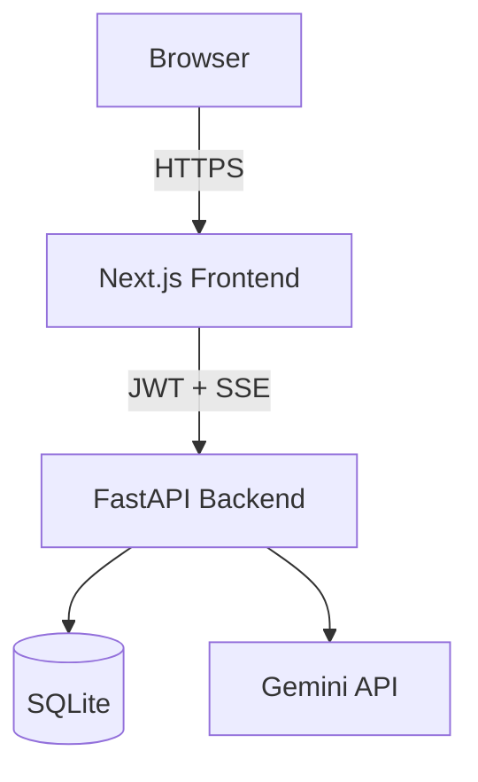

# AI Email Responder

**Paste an email. Pick a tone. Get a polished reply — streamed live.**

An AI-powered email assistant built as a complete, production-ready SaaS: JWT auth, streaming AI replies via Google's Gemini API, reusable templates, searchable history, and usage analytics — all behind a premium, glassmorphic dark UI.

[](./LICENSE)
[](https://nextjs.org)
[](https://www.typescriptlang.org)
[](https://fastapi.tiangolo.com)
[](https://ai.google.dev)
[](https://docs.docker.com/compose/)

---

## 📸 Screenshots

### Home Page
.png)

### Login Page
.png)

### Dashboard
.png)

### Auto email Generate page
.png)

### Multiple generative options
.png)

### Many variations of same response
.png)

### History Page
.png)

### Analytics
.png)

### Settings
.png)


---

## Features

| Area | What's included |
|---|---|
| **Auth** | Register/login, JWT (7-day expiry), edge-middleware route protection, rate-limited endpoints |
| **Generator** | 8 tones · 3 lengths · 5 languages · streaming replies (SSE) · regenerate · multi-variation comparison · copy · save as draft |
| **Templates** | Reusable prompt instructions grouped by category, one-click "use in generator" |
| **History** | Full searchable log of every generated reply |
| **Drafts** | Save, edit, favorite, search, delete |
| **Analytics** | Total emails, drafts, token usage, 14-day usage chart (zero-filled) |
| **Design** | Glassmorphism, custom dark palette, Framer Motion (respects `prefers-reduced-motion`), mobile nav, full accessibility pass |
| **Ops** | Docker Compose, health check, structured logging, rate limiting, input validation |

## Tech stack

**Frontend:** Next.js 15 (App Router) · TypeScript · Tailwind CSS · shadcn/ui-pattern components · Framer Motion · Zustand · react-hook-form + Zod
**Backend:** FastAPI · SQLAlchemy · SQLite · python-jose (JWT) · passlib (bcrypt) · slowapi (rate limiting)
**AI:** Google Gemini API (`gemini-3.5-flash`) via `google-genai`
**Infra:** Docker · Docker Compose

## Architecture



Full diagrams (request sequence, backend layering, auth flow) are in **[docs/ARCHITECTURE.md](./docs/ARCHITECTURE.md)**.

## Quick start

### Docker (recommended)

```bash
cp .env.example .env   # fill in GEMINI_API_KEY and JWT_SECRET
docker compose up --build
```

- Frontend → http://localhost:3000
- Backend health check → http://localhost:8000/health

### Manual

```bash
# Backend
cd backend
python -m venv venv && source venv/bin/activate
pip install -r requirements.txt
cp ../.env.example ../.env
uvicorn app.main:app --reload --port 8000

# Frontend (separate terminal)
cd frontend
npm install
npm run dev
```

Full setup, environment variable reference, and production checklist: **[docs/DEPLOYMENT.md](./docs/DEPLOYMENT.md)**.

### Getting a free Gemini API key
1. Go to https://aistudio.google.com/apikey
2. Sign in with a Google account → **Create API key**
3. Paste it into `.env` as `GEMINI_API_KEY`

## Environment variables

See [`.env.example`](./.env.example) for the full list with defaults. The essentials:

| Variable | Required | Notes |
|---|---|---|
| `GEMINI_API_KEY` | Yes | Free tier is sufficient to run this project |
| `JWT_SECRET` | Yes | Generate with `openssl rand -hex 32` |
| `CORS_ORIGINS` | Yes in production | Your real frontend origin(s) |
| `NEXT_PUBLIC_API_URL` | Yes | Must be set at Docker **build** time, not just runtime |

## Documentation

| Doc | Covers |
|---|---|
| [docs/API.md](./docs/API.md) | Every endpoint, request/response shapes, the SSE streaming contract |
| [docs/ARCHITECTURE.md](./docs/ARCHITECTURE.md) | System diagram, request sequence, backend layering, auth flow |
| [docs/DEPLOYMENT.md](./docs/DEPLOYMENT.md) | Docker + manual deployment, reverse proxy notes, production checklist |
| [docs/PORTFOLIO.md](./docs/PORTFOLIO.md) | Portfolio description, LinkedIn post, resume bullets, client proposal, future improvements |

## Project structure

```
ai-email-responder/
├── frontend/          Next.js 15 app (App Router)
├── backend/           FastAPI app
├── docs/              API, architecture, deployment, portfolio docs
├── docker-compose.yml
└── .env.example
```

## License

MIT — see [LICENSE](./LICENSE).
