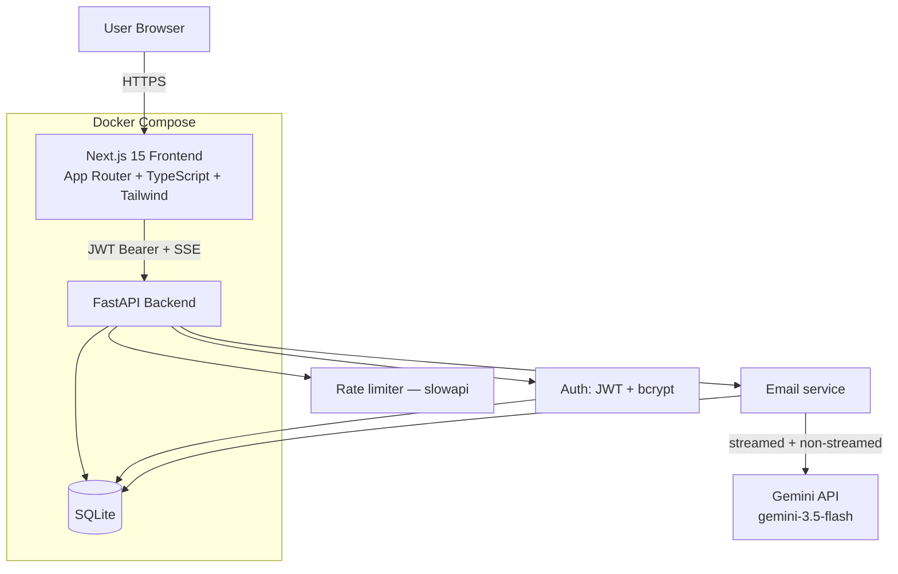
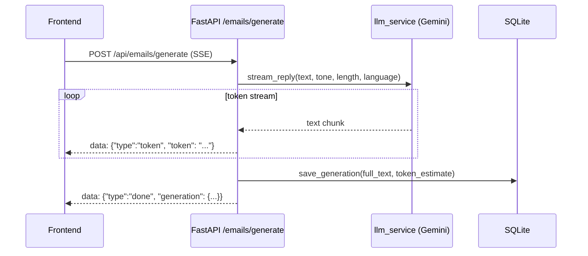

# Architecture

## System overview



## Backend layering

The backend follows a straightforward clean-architecture split — each layer only knows about the one below it:

```
routers/     → HTTP concerns only: parse request, call a service, shape the response.
services/    → business logic: auth rules, prompt building, SSE framing, DB writes.
models/      → SQLAlchemy ORM — the persistence shape.
schemas/     → Pydantic — the wire shape (request/response validation).
core/        → cross-cutting: config, JWT/password helpers, rate limiter, logging, the
               shared get_current_user dependency every protected route depends on.
```

`models` and `schemas` are deliberately separate (not one shared class) — the DB shape and the API shape are allowed to diverge (e.g. `hashed_password` never appears in a schema) without one dictating the other.

## Request flow: generating a reply (the core feature)



Streaming vs. non-streamed is an intentional split, not an inconsistency: the primary generate/regenerate path streams (real-time UX matters most there); the "variations" feature runs N generations concurrently via `asyncio.gather` without streaming, since multiplexing several simultaneous token streams into side-by-side UI cards adds real complexity for marginal benefit over a short loading state. Documented in `llm_service.py`'s module docstring.

## Auth flow

JWT is stored in a **cookie**, not just browser storage — this matters because Next.js `middleware.ts` runs on the edge, before any client JS executes, and can only inspect cookies. Protected `(dashboard)` routes are gated server-side before the page ever renders; the Zustand store separately caches the user profile for instant UI hydration without an extra round-trip on every navigation.

## Frontend structure

```
app/                    → Next.js App Router pages, grouped by (auth) and (dashboard) route groups
components/ui/          → shadcn/ui-style primitives (Button, Card, Dialog, Select, ...)
components/<feature>/   → feature-specific composed components (generator, dashboard, templates, auth)
hooks/                  → data fetching + business logic (useAuth, useEmailGenerator, useDrafts, ...)
lib/                    → api client, types, utils, motion variants, nav config
store/                  → Zustand (auth profile cache only — everything else is local/hook state)
```

Data fetching is intentionally plain `fetch` + hooks rather than a query library (React Query/SWR) — the app's data needs (a handful of list/detail views, one streaming endpoint) don't yet justify the dependency; each hook owns its own loading/error state explicitly.

## Why SQLite

Single-file, zero-ops, trivial to back up, and the SQLAlchemy models carry no SQLite-specific logic — see `docs/DEPLOYMENT.md` for the (config-only) path to Postgres if you outgrow it.
